# Reconstruction d'écoulements

## Table des Matières

- [Description](#description)
- [Fichiers](#fichiers)
- [Utilisation](#utilisation)

## Description

Ce dossier montre un exemple d'utilisation du code pour tenter de prédire des écoulements sur lesquels nous n'avons pas entraîné le modèle. 

### Prédictions d'écoulements de validation :
Sur des données de validation, on plot l'écoulement prédit ainsi que la courbe du coefficient de portance.

#### H = 230.67 y0 = 3.13e-3
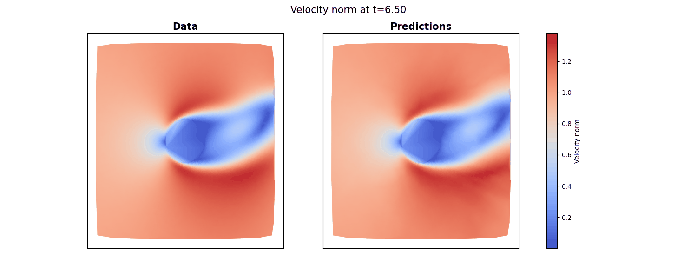
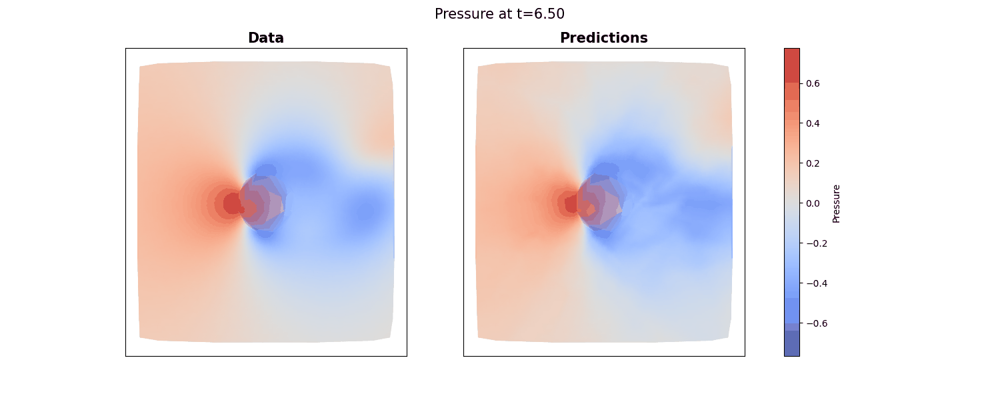
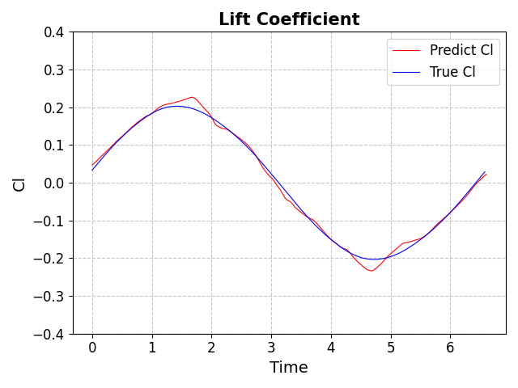

#### H = 261.39 y0 = 5.00e-3
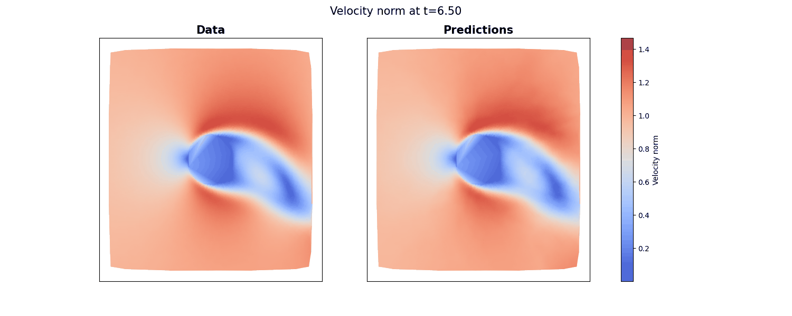
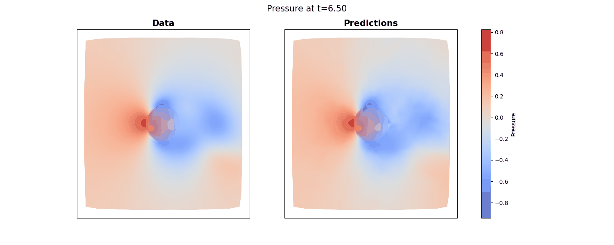

#### H = 230.67 y0 = 6.88e-03
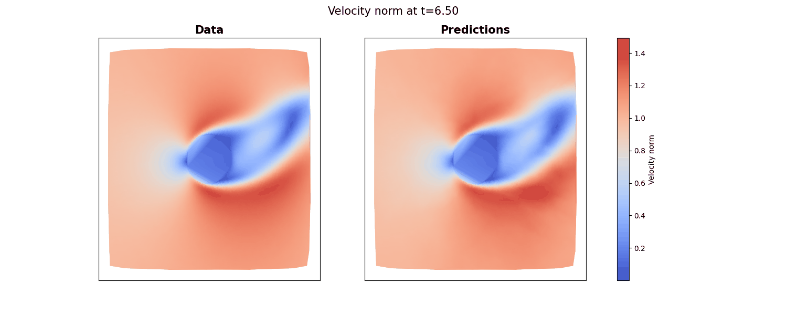
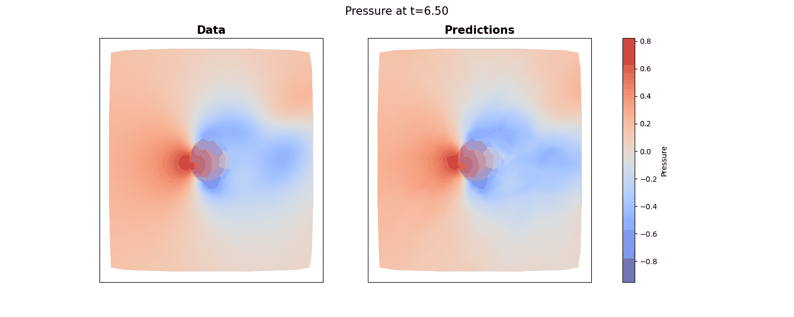
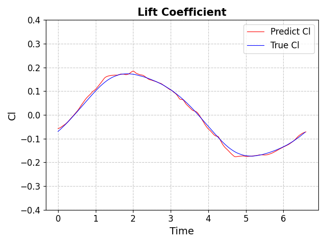

#### H = 261.39 y0 = 8.75e-03
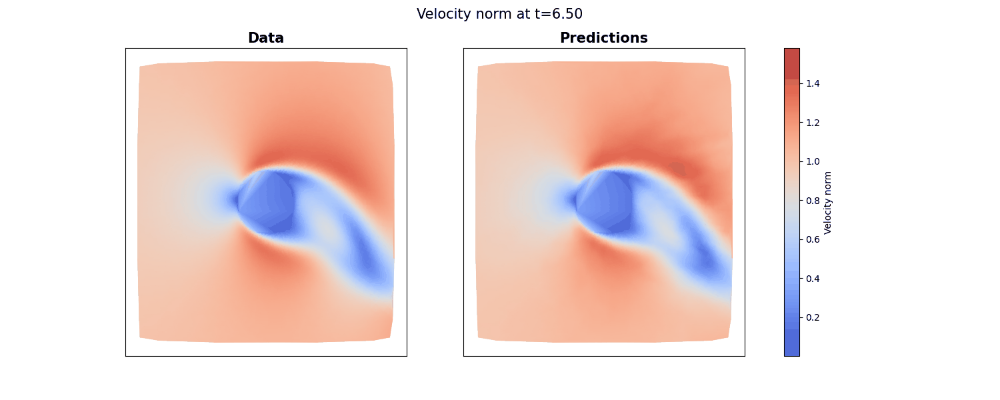
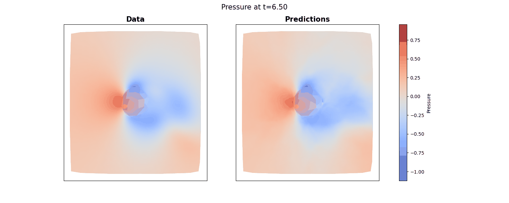
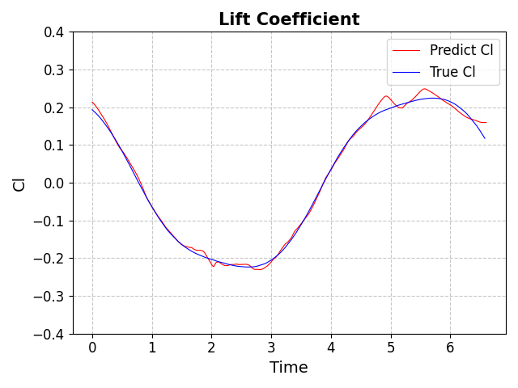

## Fichiers

- `main` : Il permet de lancer le fichier, on peut rentrer les hyperparamètres de nos simulations dans ce fichier.
- `model.py` : Il contient la construction des différentes architectures de réseaux de neurones ainsi que la fonction qui permet de calculer les résidus de l'équation différentielle
- `geometry.py` : Il contient la classe `RectangleWithoutCylinder` qui permet d'avoir des points de l'espace (x,y,t) afin de tester les résidus de l'EDP sur ces valeurs
- `constants.py` : Pour stocker des constantes dont on pourrait se servir
- `onyxia-init.sh`: Le fichier qu'on met dans onyxia pour préinstaller les différents modules
- `run.py` : Le fichier avec une classe qui permet de lancer les simulations. Il permet de faire le lien entre tous les fichiers.
- `utils.py` : Pour charger les données sur lesquelles on va entraîner notre modèle, permet aussi de charger le modèle.
- `train.py` : C'est ici que l'on va faire l'optimisation et nos différentes epochs
- `results` : Chaque dossier représente une simulation différente, dans chaque dossier on retrouve le modèle aux différentes epochs ainsi que les plots qui ont été réalisés sur le modèle entraîné. On trouvera aussi les hyperparamètres de chaque simulation dans le fichier hyperparam.json
- `data`: dossier à créer pour mettre les données des modèles dans le domaine ainsi que sur les bords des domaines (me contacter ou demander à John Redford pour y avoir accès.)
- `results_Cl` : dossier ou l'on a les résultats attendus de portance, pour comparer les résultats de nos modèles. On obtient ces résultats avec le code de John Redford
- `plot_....ipynb` : afin de plot une certaine valeur. On retrouvera le plot dans le dossier results
- `read_reduce.csv`: afin d'importer les csv d'Onyxia et de réduire leur taille pour ne pas arriver à cours de place sur le VS code
 

## Utilisation

Il faut charger les données dans un dossier data dans ce fichier (cf utilisation d'onyxia dans le rapport)

Ensuite régler les hyperparamètres comme on en a envie

Et enfin on peut lancer dans le terminal avec la commande python main.py
